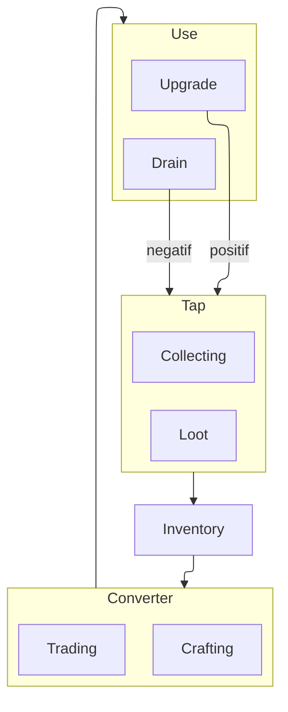

## Tap
Invloei van resources: 
* loot 
* Exp 
* Gold
* Crafting Material

**Kan een aanmoedeging zijn voor Taken te doe** 

## Inventory 
Het bijhouden van [[Resources]] en Items. 
Zorgt voor een limiet: 
+ + meer items gebruiken
+ - Moeilijke te controleren
	+ fysieke resource regelen zicht zelf. 
	+ wordt meestal vervangen door kaarten of kleinere items

## Converter
Het omzetten van [[Resources]] in Items
Dit wordt gedaan door [[Crafting]] en trading. 

### Trading
Verschillende soorten met elk een voorkeur en specialiteit.
Hierdoor is er meer vraag en aanbod. 

## Upgrade

Zorgt er voor dat de [[#Tap]] beter werkt bvb: 
- meer damage -> makellijker te queesten

## Drain 
Verwijderd [[Resources]] uit het spel bvb: 
- Hp -> healing potions
- Kogels
- Belastingen
- Breekbare wapens
- Breekbaar gereedschap
- Gestolen geld