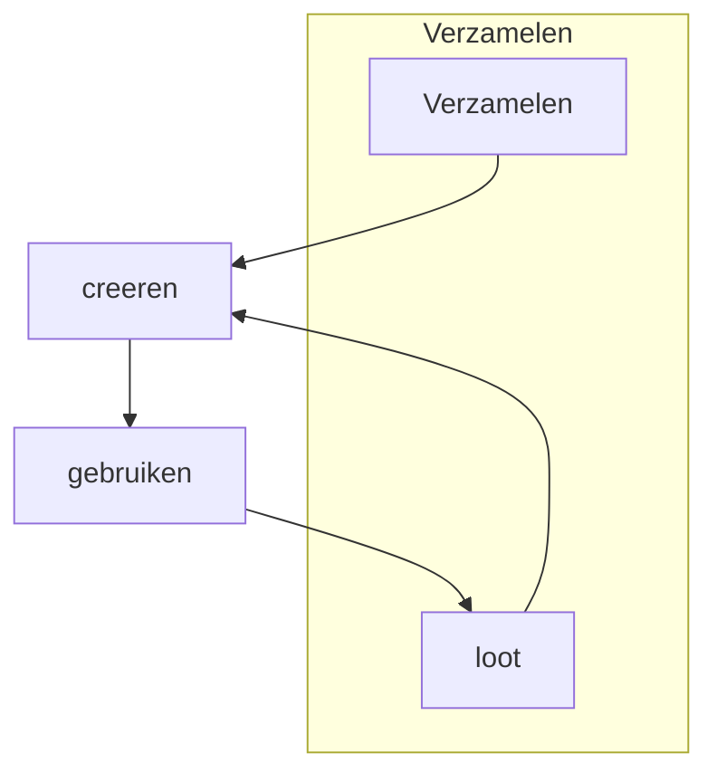

## Flow
### verzamelen
Het verzamelen van recources. 

Deze bestaat uit 2 delen

### creeren
Het maken van items

### gebruiken
Het gebruiken van items
## Ideeen 
### munten
inplaats van metalen munten its anders bv:
* kroonkurken
* knikkers
* ...
lijkt me iets goed koper en maakt de larp iets specialer (zeker als er een lore reden voor is).

